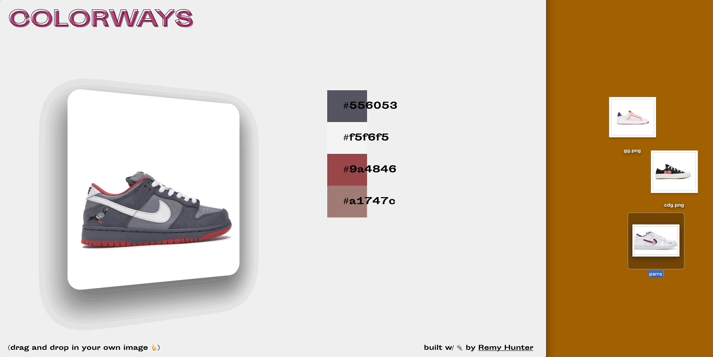

# Colorways <a href="https://npm.im/colorways"></a> <a href="https://npm.im/colorways"></a> <a href="https://packagephobia.now.sh/result?p=colorways"></a>



# [Demo 👆](colorways-js.netlify.app)

Please this project by ⭐️ starring it [Follow me](https://github.com/remyhunt)

## Installation

```bash
$ npm install colorways
```


## Usage

```javascript
import { getPalette } from 'colorways'

const palette = getPalette(__imageUrl, 5, __callback())

console.log(palette)
```

## Special Thanks & Prior Work

https://github.com/olivierlesnicki/quantize

https://github.com/lokesh/color-thief

# License

Licensed under the MIT License.